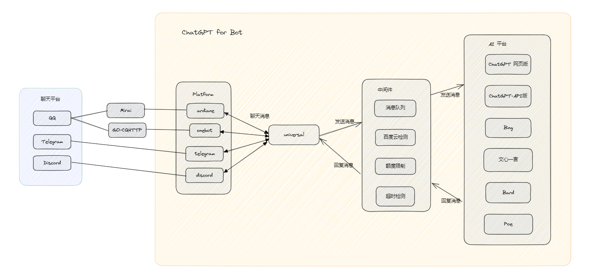

# 👋 ChatGPT for Bot 使用文档

## Overview

ChatGPT for Bot 是一个支持多平台、多语言模型的聊天机器人项目。

它可以让你在聊天平台上对接语言模型，实现和语言模型的直接对话。

<figure><figcaption></figcaption></figure>

## 快捷链接


[kuai-su-bu-shu-jiao-cheng](bu-shu-jiao-cheng/kuai-su-bu-shu-jiao-cheng/)



[dui-jie-onebot-gocqhttp.md](pei-zhi-wen-jian-jiao-cheng/dui-jie-liao-tian-ping-tai/dui-jie-onebot-gocqhttp.md)


## 开始使用

我们建议您按照菜单顺序自上而下阅读项目文档。

## 帮助我们完善文档

我们的文档在 GitHub 开源，你可以从这个地址访问：



本文档基于 CC-BY 4.0 协议开源。