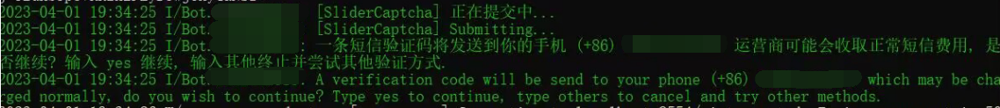

# Windows 快速部署教程


本文难度：**低**

适合新人部署


如果你想在 Windows 上部署这个项目，那么你将需要：

* Python 3.11 或以上
* 本项目

如果你想部署成 QQ 机器人，那么还需要 Java、mirai、mirai-console-loader、mirai-api-http 等一大票东西。

不过别担心，只要使用 Windows 快速部署包，这些东西都会有的。

## 0x00 获取最新版本的 Windows 快速部署包

打开项目的发布页面：[https://github.com/lss233/chatgpt-mirai-qq-bot/releases](https://github.com/lss233/chatgpt-mirai-qq-bot/releases)

排在最顶部的版本通常旁边有一个蓝色的 `Latest` 标识，这就说明它是项目的最新版本。

你可以在这张卡片的下方找到一个名为 `Windows-quickstart-refs.tags.vx.x.x.zip` 的文件，其中， `x.x.x` 为版本号。这就是最新版本的 Windows 快速部署包，点击即可下载。

<figure><figcaption></figcaption></figure>

## 0x01 解压，初始化

快速部署包下载完成后，第一件事就是解压。

解压完成后，你可以看见一个文件夹，进去之后是这样：

<figure><figcaption></figcaption></figure>

我们需要执行 `初始化.cmd` 。它会为你安装一些依赖和插件。

启动 `初始化.cmd` 之后的界面如下图所示，你要做的就是**按照程序的指示**，不断地按回车。

<figure><figcaption></figcaption></figure>

随后，一个记事本会被弹出，这是初始化程序想让你填写配置文件。

这个时候，你可以参考这里的教程来填写配置文件：


[dui-jie-liao-tian-ping-tai](../../pei-zhi-wen-jian-jiao-cheng/dui-jie-liao-tian-ping-tai/)



[jie-ru-ai-ping-tai](../../pei-zhi-wen-jian-jiao-cheng/jie-ru-ai-ping-tai/)


完成之后，保存文件，然后关闭记事本，根据程序的指示结束初始化。


## 0x02 首次启动 ChatGPT

首次启动的过程是最艰难的，有 80% 的小白止步于此，但它其实很容易。

我们先双击 `启动 ChatGPT.cmd` ，如果你的运气爆棚，你会看见类似这样的提示：

<figure><figcaption></figcaption></figure>

如果你遇到了错误，别急，请参考下面这个链接来排查你的问题：


[.](./)


当你的 ChatGPT 顺利启动以后，保持这个窗口开着别关！接下来，我们启动 Mirai。

## 0x03 首次启动 Mirai

启动 Mirai 的过程是萌新的第二场噩梦，但它其实也很容易。

首先，双击 `启动 Mirai.cmd`，然后等待程序启动完毕。

如果你看见了红色的错误提示，无需理会。

<figure><figcaption></figcaption></figure>

但是当你看到这样一行日志的时候，说明它已经启动完毕了，接下来我们要做的就是登录 QQ。

### 登录 QQ

选中这个 `启动 Mirai.cmd` 之后出现的黑色窗口，然后输入下面的命令：

`login 你机器人的QQ号 你机器人的密码 MACOS`

然后轻轻敲一下回车。这个时候，Mirai 就会尝试登录你提供的账号。

<figure><figcaption></figcaption></figure>

### 完成滑动验证

接下来，Mirai 很有可能会要求你提供验证码。这个验证码其实就和你平时登录 QQ 时做的验证码是一样的。&#x20;

<figure><figcaption></figcaption></figure>

我们用鼠标选中 Mirai 提供的那一段链接，然后按一下 **鼠标右键**，这段链接就会被复制。

打开浏览器，在地址栏中粘贴你复制的链接并回车，你会看见一个这样的页面：

<figure><figcaption></figcaption></figure>

接下来，我们对着页面的空白处按下 F12，打开 **开发人员工具**。

切换到 Network（网络） 选项卡，然后在这个框中输入 `verify`

<figure><figcaption></figcaption></figure>

我们放着这个窗口不管，回到刚刚那个网页，把所有的滑动验证完成，直到它不再出现新的验证码。

这个时候，回到**开发人员工具**的窗口，你会发现多出了几个 `cap_union_new_verify`。

我们选中最后一个，然后点击右边的 **Preview**（或者叫预览） 。

然后右键 ticket 后面的那串代码，点击复制。

<figure><figcaption></figcaption></figure>

回到  `启动 Mirai.cmd`的那个黑色窗口，按下鼠标右键，那串代码就会被粘贴到里面。

我们按下回车，继续。


### 完成手机短信验证

接下来，Mirai 很有可能会让你进行短信验证。通常到了这一步的时候，你离整个项目顺利运行已经不远了。

看到下面这段提示后，我们输入 `yes` 回车。

<figure><figcaption></figcaption></figure>

随后你的手机上将会收到一条短信验证码，把验证码中的数字输入到窗口中，然后回车。


#### 设置自动登录

当你看见这样的提示时，说明 Mirai 已经成功登录并接管了你机器人的 QQ。

<figure><figcaption></figcaption></figure>

你当然不想让登录的过程如此复杂，所以接下来我们要设置自动登录

在窗口中输入以下几条命令：

```
autologin add 你机器人的QQ号 你机器人的QQ密码
autologin setConfig 你机器人的QQ号 PROTOCOL MACOS
```

这样，下次启动 Mirai 时，它就会自动登录你机器人的 QQ。


自此，部署完毕。你就可以发消息给你的机器人 QQ 试试效果了。
