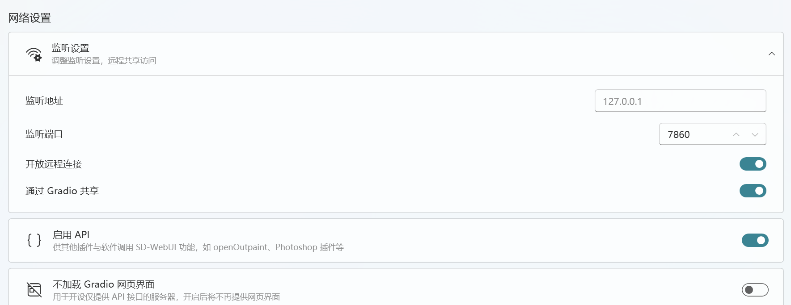
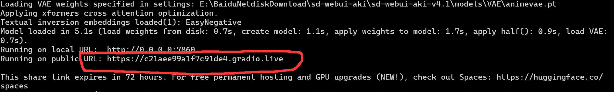

# 🐉 AI 画图

目前我们支持的画图 AI 有：

* Stable Diffusion
* Bing 画图 (由 Bing 帮你生成 DALL·E)
* OpenAI 画图（直接使用 DALL·E)
* 文心一言

如果你当前使用的语言模型是文心一言，那么就会使用文心一言的 AI 画图功能：

[jie-ru-wen-xin-yi-yan.md](jie-ru-ai-ping-tai/jie-ru-wen-xin-yi-yan.md "mention")

如果你使用其他的语言模型，那么则会根据你上面设置的顺序来选择使用哪个画图 AI，不支持切换。

## 🥑接入 Stable Diffusion 画图

Stable Diffusion 需要你搭建一个 sd-webui，云GPU型服务器有公网IP才能接入

然后在`config.cfg`中加入以下内容：

```toml
[sdwebui]
# sd-webui 的接口地址地址
api_url='http://127.0.0.1:7860/'
# 内置提示词，所有的画图内容都会加上这些提示词
prompt_prefix = 'masterpiece, best quality, illustration, extremely detailed 8K wallpaper'
# 负面提示词，sd 的一个参数
negative_prompt = 'NG_DeepNegative_V1_75T, badhandv4, EasyNegative, bad hands, missing fingers, cropped legs, worst quality, low quality, normal quality, jpeg artifacts, blurry,missing arms, long neck, Humpbacked,multiple breasts, mutated hands and fingers, long body, mutation, poorly drawn , bad anatomy,bad shadow,unnatural body, fused breasts, bad breasts, more than one person,wings on halo,small wings, 2girls, lowres, bad anatomy, text, error, extra digit, fewer digits, cropped, worst quality, low quality, normal quality, jpeg artifacts, signature, watermark, username, out of frame, lowres, text, error, cropped, worst quality, low quality, jpeg artifacts, ugly, duplicate, morbid, mutilated, out of frame, extra fingers, mutated hands, poorly drawn hands, poorly drawn face, mutation, deformed, dehydrated, bad anatomy, bad proportions, extra limbs, cloned face, disfigured, gross proportions, malformed limbs, missing arms, missing legs, extra arms, extra legs, fused fingers, too many fingers,'
# 这也是 sd 的一个参数
sampler_index = 'DPM++ SDE Karras'
# 这还是 sd 的一个参数
filter_nsfw = true
# 你可以在这里看所有支持的 sd 参数: https://github.com/AUTOMATIC1111/stable-diffusion-webui/wiki/API
# 画图超时时间，单位为秒
timeout = 10.0
```

### 推荐使用秋叶的整合包

以下sd是在自己电脑跑



<figure><figcaption></figcaption></figure>

* 1.打开启动器→高级选项→网络设置

<figure><figcaption></figcaption></figure>

&#x20;          如果机器人在本地，Gradio共享不用打开

* 2.打开允许加载不安全的模型

<figure><figcaption></figcaption></figure>

* &#x20;3.复制红框,URL

<figure><figcaption></figcaption></figure>

```
api_url='https://c2laee99alf7c91de4.gradio.live'     #替换
```

## 接入 Bing 画图

如果你想使用 Bing 的画图功能，那么你需要接入一个 Bing 账号，然后开启 Bing 画图功能。

参考：[#jie-ru-new-bing-sydney](jie-ru-ai-ping-tai/#jie-ru-new-bing-sydney "mention")

```toml
[bing]

# 开启 Bing 画图
use_drawing = true

[[bing.accounts]]
cookie_content = '你的 Bing 账号信息'
```

部分用户可能无法使用 Bing 画图,请阅读:



## 接入 OpenAI DALL·E 画图

[#jie-ru-api-ban-openai-chatgpt](jie-ru-ai-ping-tai/jie-ru-openai-de-chatgpt.md#jie-ru-api-ban-openai-chatgpt "mention")

使用 OpenAI 的 API 画图时将会调用 DALL·E 模型进行绘画，它的费用为 0.018 美元/张。

## 使用画图功能

触发的指令请参考：

[#ai-hua-tu](chu-fa-xing-shi-yu-zhi-ling.md#ai-hua-tu "mention")
