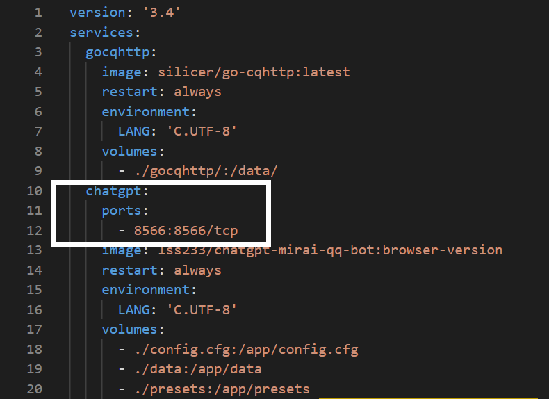

# 🙇 对接 OneBot (go-cqhttp)

OneBot 协议可以用于对接 go-cqhttp 等机器人框架。

如果你要使用 OneBot 协议，那么你就将 `config.cfg` 中的 `[mirai]` 块删除，然后加入以下配置：

```properties
[onebot]
qq=请修改为你机器人的QQ号
manager_qq = 请修改为机器人管理员的QQ号

reverse_ws_host = "0.0.0.0"
reverse_ws_port = 8566
```

就可以使用 go-cqhttp 或者其他支持 OneBot 协议的程序和 ChatGPT 聊天！

[gocqhttp-qi-dong-guo-cheng-zhong-de-chang-jian-wen-ti.md](../../chang-jian-wen-ti-jie-da/gocqhttp-qi-dong-guo-cheng-zhong-de-chang-jian-wen-ti.md "mention")

## go-cqhttp 的设置教程

### 1. 下载 go-cqhttp



### 2. 初始化 go-cqhttp

解压并启动 go-cqhttp，选 `3` 后回车，退出程序。

<figure><figcaption></figcaption></figure>

### 3. 设置 go-cqhttp

编辑 go-cqhttp 的 `config.yaml`，设置机器人的 QQ 号和反向 Universal 地址 （这个反向 Universal 地址和前面的 `reverse_ws_host` 、`reverse_ws_port` ）有关。

<figure><figcaption></figcaption></figure>

<figure><figcaption></figcaption></figure>

go-cqhttp 和 chatgpt在同一台机器（电脑）

```
ws://localhost:8566/ws   #这里的 8566 和 reverse_ws_port的值是一样的。
ws://127.0.0.1:8566/ws   #win系统默认127.0.0.1
ws://chatgpt:8554/ws     #linux一键部署脚本默认
```

go-cqhttp 和 chatgpt 在不同的机器 ，`localhost` →服务器的 IP 地址

```
ws//13.250.31.91:8566/ws #这里的13.250.31.91为服务器ip
```

### 🍊 映射 \`reverse\_ws\_port\` 端口

这一步是使用 Docker部署的同学才需要做的， Windows 用户可以直接跳过。

打开 docker-compose.yaml，在图中的位置加入下面这么一行 ：

```
ports:
      - 8566:8566/tcp
```

<figure><figcaption></figcaption></figure>

然后执行 `docker-compose up -d` 更新即可。

<figure><figcaption></figcaption></figure>

### 4. 启动 go-cqhttp，生成配置文件

首次启动时我们不要登录 QQ，我们只是需要它生成的 `device.json`文件。

<figure><figcaption></figcaption></figure>

### 5. 打开 device.json，修改协议

找到 `protocol`，把后面的数字改成 2，然后保存并退出即可。

这会让 go-cqhttp 使用 Android Watch 协议进行登录。

<figure><figcaption></figcaption></figure>

### 6. 启动 go-cqhttp，扫码并登录

<figure><figcaption></figcaption></figure>

### 注意事项

这个go-cqhttp 的扫码登录，是需要你自己的手机 QQ 和 go-cqhttp 在同一个网络环境下的才能成功的。

#### win，Linux服务器部署：同步 session.token 文件

在自己的电脑上来登陆一次 go-cqhttp，扫码登录成功后

把`device.json和session.token`放到服务器go-cqhttp文件夹中

#### 本地：go-cqhttp在自己电脑运行

自己的电脑上跑 go-cqhttp，在服务器跑 chatgpt

将 `127.0.0.1` → chatgpt 服务器的公网 IP 地址。

记得在云服务器安全组开放对应端口

```
ws//13.250.31.91:8566/ws #这里的13.250.31.91为服务器ip
```

